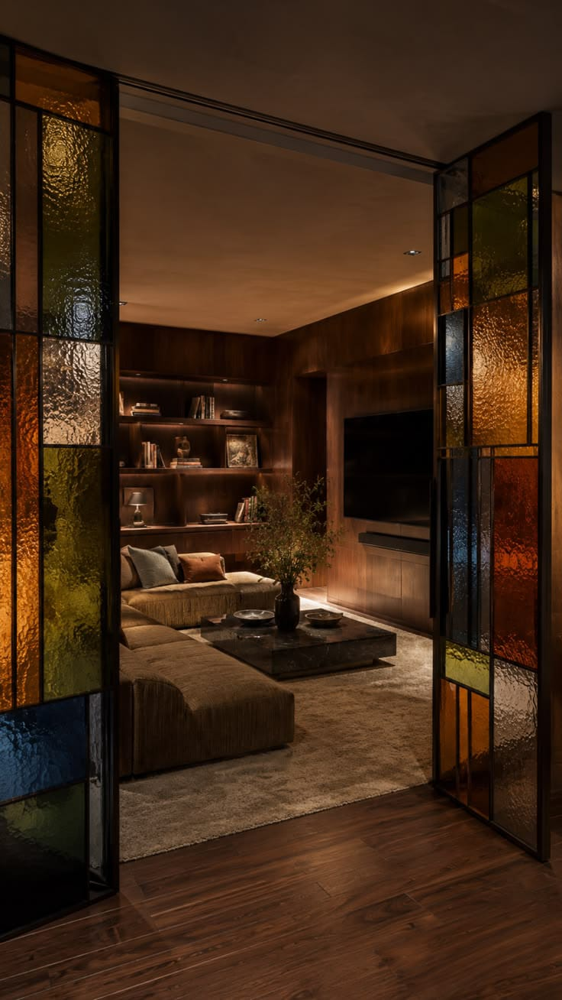
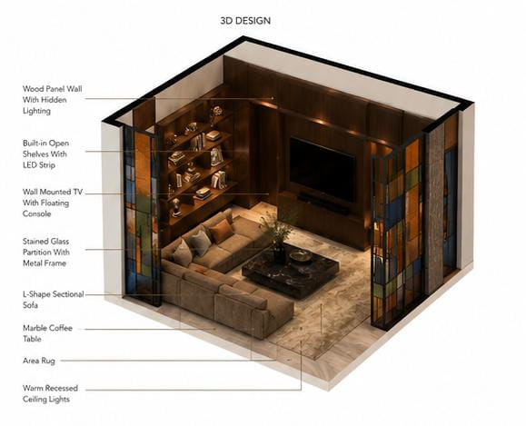
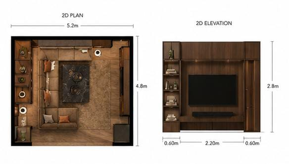
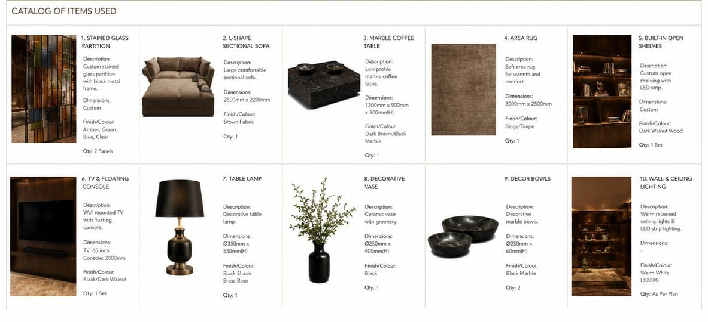
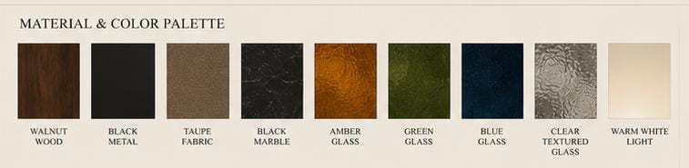

# Mark K. Williams — Interior Design Portfolio

A single-page portfolio site showcasing interior design work by **Mark K. Williams**, based in Kenya. Bold, earthy palette with a focus on African-inspired, edgy interiors and glass art.



## Live Site

Once GitHub Pages is enabled (Settings → Pages), the site will be live at:

**`https://andY-GAD.github.io/Portfolio/`**

## About

This site presents a curated look at Mark's design process and finished spaces — from concept to material selection.

| | |
|---|---|
| **Style** | Kenyan interior design — bold, textured, glass-forward |
| **Format** | Single-page site, static HTML/CSS |
| **Dependencies** | None — no build step, no frameworks |

## Gallery

| 3D Design | 2D Floor Plan |
|---|---|
|  |  |

| Items Used | Materials & Colors |
|---|---|
|  |  |

## Project Structure

```
.
├── index.html    # full site — markup, styles, content
├── image.jpeg    # mosaic of mirrors (hero/preview)
├── 3dplan.jpeg   # 3D design render
├── 2dplan.jpeg   # 2D floor plan
├── items.jpeg    # items used
├── mc.jpeg       # materials and colors
└── README.md
```

## Running Locally

No install needed — just open `index.html` in a browser:

```bash
git clone https://github.com/<your-username>/<repo-name>.git
cd <repo-name>
open index.html   # or double-click it
```

## Built With

Plain HTML & CSS — no frameworks, no dependencies.
